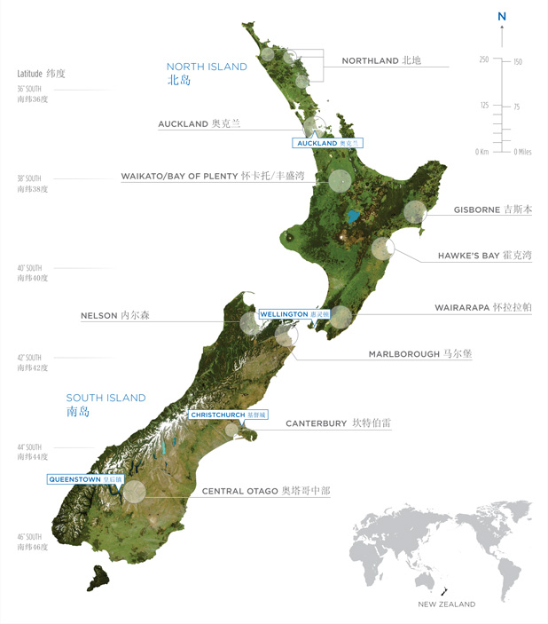

# jQuery RWD Image Maps

### Allows image maps to be used in a responsive design to match the actual image size on load and window.resize

### a标签模拟 img maps，支持响应式

---

#### Usage:

	
	<div class="region-map js-imgMaps">
		
		<a href="#" class="rm-northland">Northland</a>
		<a href="#" class="rm-auckland">Auckland</a>
		<a href="#" class="rm-waikato">Waikato / Bay of Plenty</a>
		<a href="#" class="rm-gisborne">Gisborne</a>
		<a href="#" class="rm-hawkesbay">Hawke's Bay</a>
		<a href="#" class="rm-wairarapa">Wairarapa</a>
		<a href="#" class="rm-nelson">Nelson</a>
		<a href="#" class="rm-marlborough">Marlborough</a>
		<a href="#" class="rm-canterbury">Canterbury / Waipara</a>
		<a href="#" class="rm-central-otago">Central Otago</a>
	</div>

* 初始化原始图片和原始的锚位置；接下来就是jQuery-imgMaps的事情咯。
* 可能的话，给图片添加`width`和`height`值，你可以在css里面来做响应式。
* 添加 `jQuery` 和 `jQuery-imgMaps.js` 文件，然后：

```js
$('.js-imgMaps').imgMaps();
```

或者：

```js
$(document).ready(function(e) {
    $('.js-imgMaps').imgMaps();
});
```

或者：

```js
$(window).load(function(){
	$('.js-imgMaps').imgMaps();
});
```

#### Demo:

http://mattstow.com/experiment/responsive-image-maps/rwd-image-maps.html

